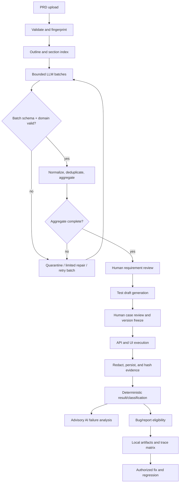

# End-to-End Data Flow

Status: planned flow; Phase 0 performs no ingestion, model call, execution, or artifact generation.

## Lifecycle overview

Every transition records stable IDs, input/output versions, actor or worker identity, timestamps, and state. Candidate and quarantined data remain separate from approved records.

## 1. PRD ingestion

The API accepts Markdown or plain text under configured type/size limits. It sanitizes the filename, prevents path traversal, computes SHA-256, stores an immutable source version, and records encoding, byte count, and upload metadata. Duplicate content may reuse storage but creates an explicit project association. Unsupported or unsafe inputs fail before model processing.

## 2. Outline and LLM batch processing

Before a provider call, deterministic code estimates characters/tokens and derives a document outline and section index. A planner creates bounded, stable batch IDs such as `ANR-<run>-B003`, limiting both source size and expected requirements/cases. Prompts reference exact source spans and versioned schemas.

Each real call records provider/model, prompt/schema versions, request ID, batch ID, timing, token usage, retries, finish reason, status, and redacted failure details. Raw responses are retained only under restricted retention policy.

## 3. Extraction, validation, and promotion

Processing order is fixed:

1. Verify transport/HTTP success and a non-truncating finish reason.
2. Detect token-limit completion and suspiciously abrupt output.
3. Extract one JSON value without executing content.
4. Check JSON closure and required-field/list completeness.
5. Validate the per-batch JSON Schema.
6. Validate domain rules, stable references, count limits, and source coverage.
7. Quarantine invalid candidates; never write them into approved tables.
8. Apply deterministic small repairs only to an allowlist of formatting faults.
9. If still invalid, regenerate the failed small batch with an idempotency key; keep successful batches.
10. Normalize stable IDs, deduplicate, merge, then run full aggregate schema, count, reference, and coverage checks.
11. Promote only a complete valid aggregate to a candidate requirement version.

Maximum retry exhaustion produces an explicit failed analysis run; no partial aggregate is presented as complete.

## 4. Human review

Reviewers see source excerpts, provenance, risks, validation warnings, and diffs. They may approve, reject, or request revision. Approval freezes a version; later edits create a new version and mark dependent drafts stale. The same workflow applies to generated test cases. Only approved case versions can produce execution snapshots.

## 5. API execution

The orchestrator snapshots approved cases and environment metadata, resolves non-secret test variables, and dispatches each API step. The executor sends the real request, captures a redacted request/response summary, extracts allowed variables, and evaluates status, schema, field, and domain assertions. Deterministic facts yield `PASS`, `FAIL`, `BLOCKED`, `ERROR`, or `SKIPPED` plus a failure type. Evidence is persisted before result finalization.

Transport/environment faults are not product assertion failures. A failed cleanup is recorded separately and cannot erase the primary result.

## 6. UI execution

The Playwright Python executor launches the recorded browser configuration, navigates to the SUT, and resolves `data-testid`, role, label, or placeholder locators. It performs only protocol-approved actions and expectations. On failure it captures current URL, screenshot, trace, browser/OS metadata, console/network summaries where allowed, and the deterministic assertion message. Secrets are masked before storage.

The seeded case fills `z1234` and `Test1234`; the expected validation error remains authoritative. Successful registration is captured as an actual-result mismatch, not reinterpreted by AI.

## 7. Evidence and result finalization

Evidence enters a staging area, passes redaction and size/type checks, is atomically moved to its final run-relative path, hashed, and registered. A result points to evidence IDs rather than mutable paths alone. If mandatory evidence persistence fails, the result becomes `ERROR` and formal artifact generation remains blocked.

Failure classification uses executor signals and ordered deterministic rules. Optional AI analysis receives redacted evidence summaries, returns schema-valid advisory content, and cannot change status or failure type.

## 8. Bug and report generation

A bug is eligible only when an accepted policy selects a deterministic failed result with complete required evidence and trace links. Markdown and JSON are rendered from one canonical bug record. Reports similarly read canonical immutable run data; HTML, Markdown, and PDF are views of the same totals and lineage. Generation failures do not mutate source results.

## 9. Regression

After explicit fix authorization, a regression run references the baseline run/result/bug and uses the same approved case version unless a reviewed change is necessary. New evidence and results are appended. Comparison reports expected/actual deltas and preserves the original failure. `BUG-AUTH-001` closes only when linked deterministic API and UI checks pass and no guardrail regresses.

## Recovery matrix

| Failure | State and recovery | Data rule |
|---|---|---|
| Unsafe/invalid upload | Reject synchronously | No analysis created |
| Provider timeout/rate limit | Retry failed batch within policy | Preserve attempt logs; no mock fallback |
| Truncated/invalid JSON | Quarantine, limited repair, regenerate batch | No candidate promotion |
| Aggregate missing references | Fail merge and retry affected batch | Approved version unchanged |
| Reviewer rejection | Revision requested | Prior version immutable |
| SUT unavailable | `BLOCKED` or `ERROR` by cause | No false product `FAIL` |
| Assertion mismatch | `FAIL` | Persist actual evidence |
| Evidence persistence failure | `ERROR`; retry persistence/run | Block bug/report |
| AI analysis failure | Result remains authoritative; advisory state failed | Never alter verdict |
| Export rendering failure | Retry export only | Never rerun or rewrite results |
| Interrupted task | Resume from durable checkpoint/idempotency key | Never duplicate approved records |
