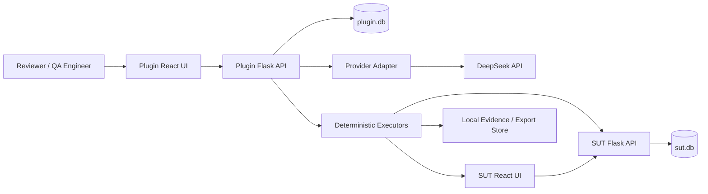

# System Architecture

Status: planned architecture; no component described here is implemented in Phase 0.

## System context

AI TestPilot contains two separately deployed local systems and two separately owned databases:

The SUT is the test target, never an internal plugin module. The plugin may reach the SUT only through its public UI/API boundaries. Cross-database joins are prohibited; traceability stores stable external identifiers in `plugin.db`.

## SUT boundary

The planned SUT frontend uses React, Vite, TypeScript, React Router, Axios, and Ant Design. It provides registration, login, a protected current-user page, logout, error feedback, responsiveness, accessibility, and a 404 route.

The planned SUT backend uses Python 3.11, Flask, Flask-SQLAlchemy, SQLite, password hashing, uniform errors, pytest, and opaque server-side sessions. It owns users and sessions, plus `/health` and authentication endpoints. It must preserve the protected five-character username defect until the authorized regression fix.

## Plugin boundary

### Frontend modules

- Mission Control: projects, runs, gates, and quality summaries.
- PRD Scanner: ingestion, outline/batch status, provider attribution, and recovery.
- Requirement Constellation: requirements, relationships, risks, and testability.
- Test Forge: generated API/UI/manual drafts, validation, review, and version freeze.
- Execution Arena: deterministic task progress and result state.
- Evidence Vault: redacted evidence previews and integrity metadata.
- Bug Archive: local bug records and lineage.
- Quality Observatory: metrics, traceability, and report access.
- Regression Portal: baseline/fix comparison.

The UI talks only to the plugin API through a typed API client. It does not call providers, databases, the SUT, or the filesystem directly.

### Backend modules

- API/presentation layer: authentication boundary if introduced, validation, pagination, idempotency, and error mapping.
- Application services: project, ingestion, analysis, review, orchestration, export, and regression use cases.
- Domain layer: stable IDs, versions, states, invariants, verdicts, and trace links.
- Infrastructure adapters: SQLAlchemy repositories, provider clients, HTTP/Playwright executors, filesystem evidence/export stores, clock, and hashing.
- Background task boundary: durable task state and resumable work; the first local version may use an in-process worker only behind the same interface.

Dependencies point inward: UI/API and infrastructure depend on application ports and domain contracts; domain code never imports Flask, SQLAlchemy, Playwright, or a provider SDK.

## Provider abstraction

`LLMProvider` accepts a versioned request containing model, messages, token budget, timeout, correlation ID, and response-format expectations. It returns raw content plus HTTP/finish/token/timing metadata or a typed failure. `DeepSeekProvider` is the first real adapter; `MockProvider` is test-only and explicitly configured. Orchestration, extraction, validation, repair, retry, and promotion remain provider-independent.

## Generation and review

The analysis pipeline builds an outline, schedules bounded requirement batches, validates each candidate, quarantines invalid output, retries only failed batches, then normalizes, deduplicates, validates the aggregate, and promotes an approved requirement version. Case generation follows the same bounded pattern and produces candidates only. Human review freezes an immutable approved test-case version and execution snapshot.

## Deterministic executors

- API executor: renders variables, issues HTTP requests, captures redacted request/response summaries, extracts variables, evaluates status/field/domain assertions, and assigns authoritative state.
- UI executor: maps approved actions to Playwright Python, applies stable locator policy, captures browser metadata/screenshots/traces, evaluates assertions, and assigns authoritative state.
- Manual executor: records reviewer steps and outcome without pretending automation.

Executors consume protocol snapshots; they do not interpret free-form model text at run time.

## Evidence, bug, report, and trace modules

The evidence service applies redaction and size policy before atomic file persistence, calculates SHA-256, and records metadata in `plugin.db`. The classifier assigns deterministic failure types from executor facts. AI analysis is stored separately as advisory content.

The bug module requires a failed result and persisted evidence, then renders local Markdown/JSON artifacts. The report module reads immutable run snapshots and generates HTML, Markdown, and PDF without recomputing verdicts. The trace module owns versioned edges from PRD through regression and detects orphaned or stale links.

## Local deployment topology

Planned local ports are SUT frontend `5173`, SUT backend `5001`, plugin frontend `5174`, and plugin backend `5002`. Data remains in separate local SQLite databases; evidence and generated reports live under ignored `artifacts/` paths. Configuration comes from a local `.env` derived from `.env.example`.

Processes will later be started through documented local commands or an optional local orchestrator. Phase 0 does not create either.

## Online extension points

After local acceptance, adapters may replace SQLite with PostgreSQL, local files with object storage, and the in-process worker with a durable queue. Reverse proxy, HTTPS, managed secrets, isolated browser workers, authentication, authorization, retention jobs, and observability become mandatory for a hosted environment. These substitutions must preserve domain contracts, provenance, deterministic verdicts, export portability, and local operation.

## Architectural constraints

- SUT and plugin data stores remain isolated.
- Provider output cannot write directly to approved domain tables.
- Formal artifacts cannot be created without persisted evidence.
- AI cannot alter authoritative results.
- No layer logs secrets or unredacted credentials.
- Generated files are never imported as trusted executable code.
